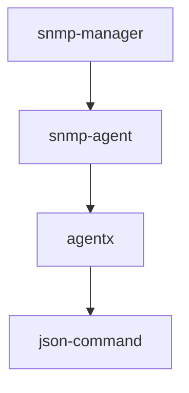

# Double AgentX

Net-SNMP has a plugin architecture that facilitates adding OIDs to monitor to
the system level SNMP Agent.  There are a few ways to extend the agent, but one
of the easiest ways is to use the AgentX subagent.

Often written in C, this subagent is written in Rust.

Double AgentX is a Net-SNMP AgentX subagent that reads JSON data from any 
JSON source and maps elements in the JSON to OIDs.  This includes using data
types for the OID.

SNMP doesn't have support for floats.  One solution is to scale the float data
to an integer.  For example, 22.5 can be scaled to 22500.  This is done by 
multiplying the float by 1000.  The MIB also defines the scale factor as a
hint.  The value can be scaled back to the original value by dividing by the
scale factor. 

Currently, reads rocm-smi output, but the intent it to read any JSON based 
on a declarative config file.

# Architecture



The snmp-manager is an app like Zabbix.  The SNMP Agent runs on each host.  For
a typical linux host this would be NET-SNMP.

Instead of writing a full-blown SNMP Agent for each thing you want to monitor,
Net-SNMP has a plugin architecture.  Net-SNMP creates a unix socket (or TCP 
port) and listens for connections there.  This subagent reads and writes to
that socket.

# Build

```shell
cargo build
cargo clippy
```


# Test

Could use some help with setting up unit tests.


# Run

You could run this with a standalone SNMP Agent (NET-SNMP) or you can use the
sytem-wide instance.  Set up your agent like this.

## Set up SNMPd

Add this to SNMPd's config /etc/snmp/snmpd.conf.  PEN is the private enterprise
number.  Request one [here](https://www.iana.org/assignments/enterprise-numbers/).
You can create the socket file to be used by yourself or the system.

```
# Add your OID to the system view
view systemview included .1.3.6.1.4.1.<pen>

# enable agentx
master agentx

agentxsocket /tmp/agentx
agentxperms 770 770 <username> <groupname>
```

The system-level agentx socket is `/var/agentx/master`.  Maybe a better place 
for a user-level socket is in `~/.local/double-agentx/`.

Confirm the MIB file has the right structure.

```shell
snmptranslate -M.:/usr/share/snmp/mibs/ietf -Tp AMDGPU-MIB::doubleagentx
```

Load the MIB file.

TODO


## Set up the app

Customize the config and run locally

```
cp template/config.yaml .
RUST_LOG=debug cargo run
```

# Deploy

Run these commands and customize files.

```shell
cargo build --release
mkdir -p ~/.config/double-agentx/
cp target/release/double-agentx ~/.config/double-agentx/
cp config.yaml ~/.config/double-agentx/
```

Find the new binary in `target/release/double-agentx` and copy it to wherever you want.


# Systemd

Systemd runs at the user-level.

After copying the service file and config file into place, customize them. 

```shell
cp template/double-agentx.service ~/.config/systemd/user/
cp template/config.yaml ~/.config/double-agentx/
systemctl daemon-reload
systemctl enable --user double-agentx.service
systemctl start --user double-agentx.service
```

Monitor logs

```shell
journalctl --user -fu double-agentx
```

# Acknowledgements

Thanks to LINBIT for creating the [agentx rust crate](https://crates.io/crates/agentx) and sharing a 
[demonstration of it](https://github.com/LINBIT/drbd-reactor/blob/master/src/plugin/agentx.rs) 
in [drbd-reactor](https://github.com/LINBIT/drbd-reactor/blob/master/src/plugin/agentx.rs).
